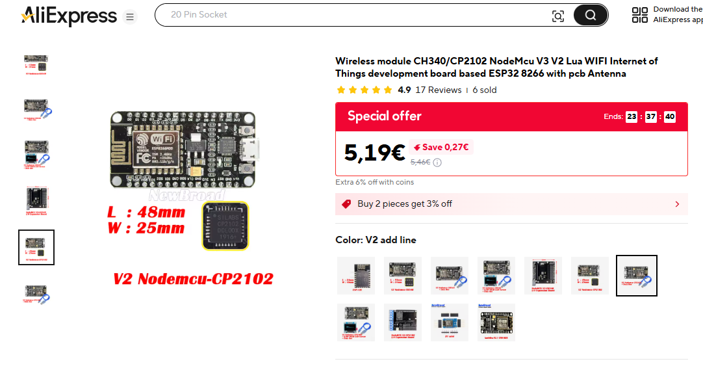
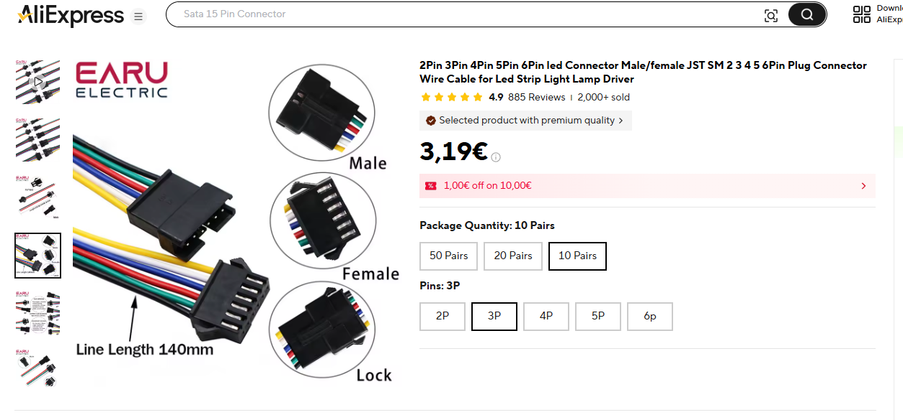
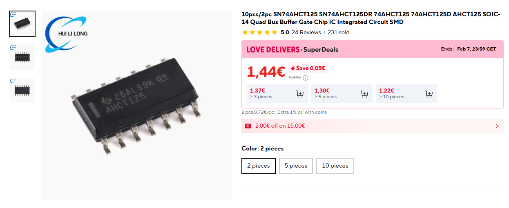
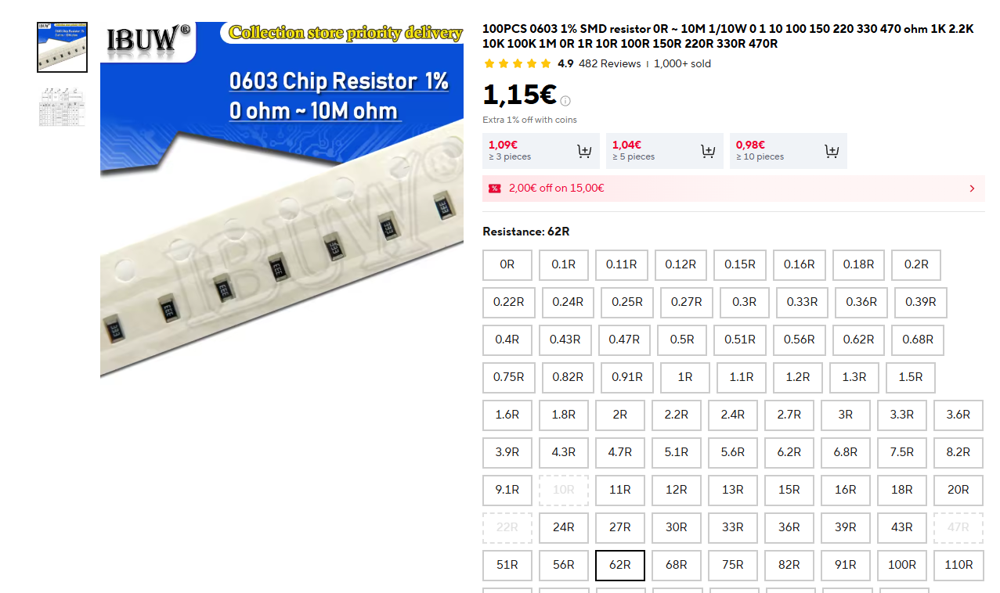
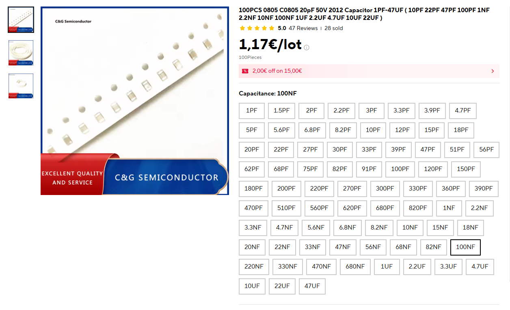

# Liste des composent que j'ai utiliser pour le projet
Voici la liste des composants que j'ai utilisé, si vous avez des doutes, ou bien, vous ne savez pas où placer les composant n'hésiter pas à consulter les plans Gerber et DXF

## Composent Aliexpress  
### Carte micro controleur ESP8266 CP2102  
[Lien](https://fr.aliexpress.com/item/1005002525057567.html?spm=a2g0o.cart.0.0.5d8a38daR6CGcD&mp=1&pdp_npi=5%40dis%21EUR%21EUR%202.09%21EUR%201.89%21%21EUR%201.78%21%21%21%40211b813b17660527445996318e71c1%2112000025046876473%21ct%21FR%21912111785%21%211%210&gatewayAdapt=glo2fra)

---
### 2 ranger de Pin header femelle 1x15 
[Lien](https://fr.aliexpress.com/item/1005003406780797.html?spm=a2g0o.order_list.order_list_main.120.14561802e50lP7&gatewayAdapt=glo2fra)

---
### Connecteur LED JST standard 3 pin 
[Lien](https://fr.aliexpress.com/item/1005004615616698.html?spm=a2g0o.order_list.order_list_main.57.14561802e50lP7&gatewayAdapt=glo2fra)

---
### Connecteur LED type carte mere (Asus AURA, MSI Mystic Light, ...) 
[Lien](https://fr.aliexpress.com/item/1005008765426201.html?spm=a2g0o.order_list.order_list_main.68.14561802e50lP7&gatewayAdapt=glo2fra)

---
### Connecteur SATA 15pin Male 90° 
[Lien](https://fr.aliexpress.com/item/32767040104.html?spm=a2g0o.order_list.order_list_main.62.15c41802xdlwtP&gatewayAdapt=glo2fra)

 
 

## Uniquement pour la version 2.0

### Levelshifter SN74AHCT125DR
[Lien](https://fr.aliexpress.com/item/1005007252553002.html?spm=a2g0o.cart.0.0.609f38dawn2tLT&mp=1&pdp_npi=6%40dis%21EUR%21EUR%204.51%21EUR%201.44%21%21EUR%201.43%21%21%21%40210384b217699523598475946e78c0%2112000039953544678%21ct%21FR%21912111785%21%211%210%21&gatewayAdapt=glo2fra)

### Résistance R0603 62 ohm
[Lien](https://fr.aliexpress.com/item/1005005677654015.html?spm=a2g0o.cart.0.0.609f38dawn2tLT&mp=1&pdp_npi=6%40dis%21EUR%21EUR%201.76%21EUR%201.15%21%21EUR%201.14%21%21%21%40210384b217699523598475946e78c0%2112000033982954152%21ct%21FR%21912111785%21%211%210%21&gatewayAdapt=glo2fra)

### Condensateur C0805 100nF
[Lien](https://fr.aliexpress.com/item/1106549969.html?spm=a2g0o.cart.0.0.609f38dawn2tLT&mp=1&pdp_npi=6%40dis%21EUR%21EUR%201.17%21EUR%201.17%21%21EUR%201.17%21%21%21%40210384b217699523598475946e78c0%2110000000764785920%21ct%21FR%21912111785%21%211%210%21&gatewayAdapt=glo2fra)

